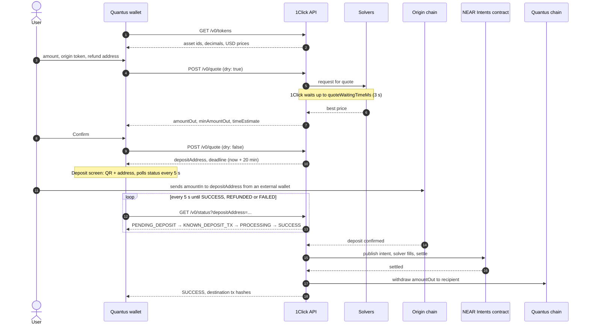
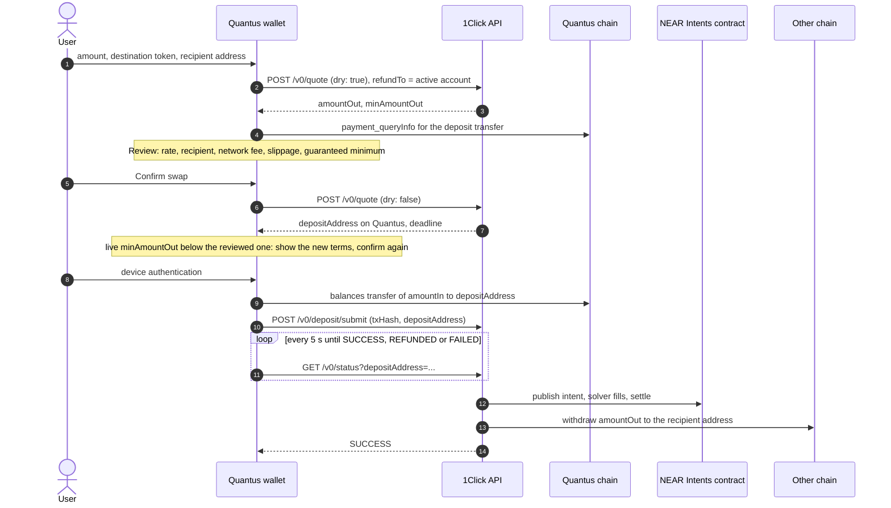
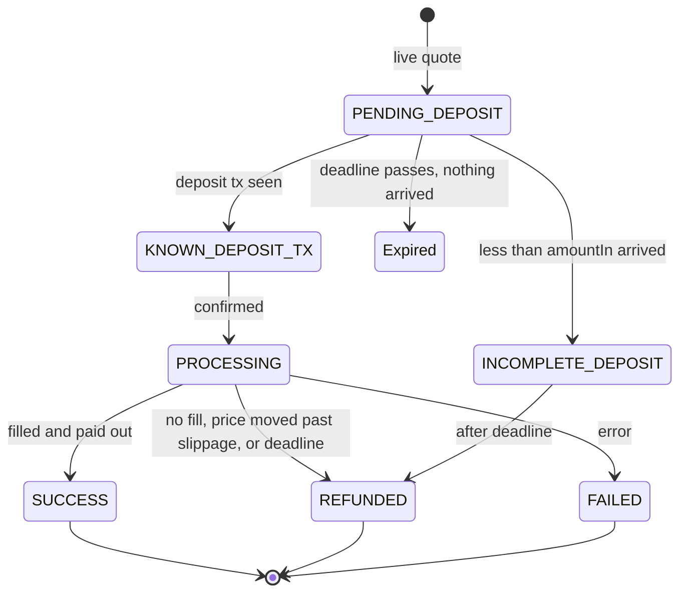

# NEAR Intents swaps

How the wallet swaps between QTC and another chain's token, in either direction, through the NEAR Intents 1Click API, who sends what, and who waits on whom.

The origin chain is where the deposit goes in: the other chain when swapping into QTC, Quantus when swapping out of it. The destination chain is where the payout lands.

Verified against the live API on 2026-09-20. There is no testnet for NEAR Intents.

## What NEAR Intents is

An intent is a signed statement of an outcome: "I give X of asset A on chain P and want at least Y of asset B on chain Q." Solvers, which are market makers, compete to fill it. The fill settles on NEAR inside the Intents Verifier contract, and bridged representations of the assets (`nep141:*.omft.near`) move in and out over NEAR's bridges.

The 1Click API (`https://1click.chaindefuser.com`) is the REST front door to all of that. It runs the price auction, hands out one deposit address per quote, watches the origin chain, drives execution, pays out and refunds. The wallet only talks to 1Click. It never signs or holds any of the swapped funds.

## Actors

| Actor | Where it runs | What it does |
| --- | --- | --- |
| User | The Quantus wallet, plus their own wallet on the other chain (MetaMask, Phantom, a BTC wallet...) | Swapping in: types the amount and a refund address, then sends the deposit from the other wallet. Swapping out: types the amount and a recipient address, then confirms. |
| Quantus wallet | The app, `SwapService` in `quantus_sdk` | Asks 1Click for tokens, quotes and status. Swapping in, the account is the recipient. Swapping out, the account is the refund address and the app signs the QTC deposit itself. |
| 1Click API | NEAR Intents infrastructure | Auction, deposit addresses, chain watching, execution, payout, refunds, status. |
| Solvers | Off-chain market makers connected to 1Click | Price the quote and fill the intent. |
| Intents Verifier contract | NEAR | Settles the fill atomically. |
| Other chain | ETH, BTC, SOL, BASE... (36 chains listed today) | The origin of a swap in, the destination of a swap out. |
| Quantus chain | Quantus | The destination of a swap in, the origin of a swap out. Not connected yet, see [Blockers](#blockers). |

## The happy path: swapping into QTC

## The happy path: swapping out of QTC

The same quote and status calls with origin and destination swapped. The difference is the deposit: the wallet sends it, so the user never leaves the app.

The deposit is an ordinary signed transfer from the active account, so only transparent accounts whose key lives in the app can swap. Encrypted, Keystone and watch-only accounts see the swap button disabled.

## Who waits on whom

| Step | Who waits | On what | How long | What ends it |
| --- | --- | --- | --- | --- |
| Token list | App | 1Click | Under a second | Response. Cached for 10 minutes in the app. |
| Dry quote | App | 1Click, which waits on solvers | 1 to 5 s (`quoteWaitingTimeMs` is 3000) | Best solver price, or "Failed to get quote" if no solver bids. |
| Live quote | App | 1Click | Same as dry | Deposit address is reserved until `deadline`. |
| Deposit | 1Click, app polls | Swapping in: the user's transaction on the other chain. Swapping out: the app's QTC transfer, handed to 1Click with `/v0/deposit/submit`. | Up to the deadline: 20 minutes in our request, 2 hours from BTC, LTC, DOGE, BCH, DASH and ZEC, whose confirmations take longer than that | Deposit seen, or deadline passes. |
| Confirmation | 1Click | Origin-chain finality | Seconds on SOL, minutes on ETH, up to an hour on BTC. Docs say allow 15 min. | Enough confirmations. |
| Settlement | 1Click | Solver fill and NEAR finality | Seconds | Intent settled. |
| Payout | 1Click | Destination-chain withdrawal | Seconds to minutes | `SUCCESS` with `destinationChainTxHashes`. |

The app never blocks on anything but its own HTTP calls and, swapping out, the QTC transfer submission. The user waits on the progress screen, and it is safe for them to leave it: 1Click continues regardless. Losing the screen does lose the order in the app, see [Blockers](#blockers).

## Who sends what

| Call | App sends | App reads back |
| --- | --- | --- |
| `GET /v0/tokens` | nothing | `assetId`, `symbol`, `blockchain`, `decimals`, `price`. One asset per symbol is kept, main network first. The entry whose `assetId` is `AppConstants.quantusIntentsAssetId` is QTC as 1Click lists it and takes over from the app's own QTC metadata; it is refused if its decimals differ from the chain's. |
| `POST /v0/quote` | `dry`, `swapType: EXACT_INPUT`, `slippageTolerance` (the picked 0.5, 1, 2 or 3%, 100 basis points by default), `originAsset`, `destinationAsset`, `amount` in base units, `depositType: ORIGIN_CHAIN`, `depositMode` (`MEMO` for a Stellar origin, which 1Click refuses to quote otherwise, `SIMPLE` everywhere else), `refundTo` and `refundType: ORIGIN_CHAIN`, `recipient` and `recipientType: DESTINATION_CHAIN`, `deadline`, `quoteWaitingTimeMs: 3000`, `referral: quantus`. `X-API-Key` header when a partner key is configured. | `quote.amountIn`, `amountOut`, `minAmountOut`, `amountInUsd`, `amountOutUsd`, `timeEstimate`, `deadline`, `depositAddress` (live only), `depositMemo` (chains such as Stellar need it on the deposit; the deposit screen shows it with its own copy action and a warning), `correlationId`, `signature`. Every quote's signature is checked before it is used (`OneClickQuoteSignature`, a port of `verifyQuoteSignature` from the 1Click TypeScript SDK: Ed25519 over the base58 SHA-256 of a key-sorted JSON of the signed request and quote fields plus `timestamp`, against `AppConstants.oneClickManagerPublicKey`), and the echoed `quoteRequest` must repeat the amount, assets, addresses, slippage and `dry` flag that were sent. Either failing is a `SwapQuoteIntegrityException`. The signed response of every live quote is kept on the device (`SwapService.getSavedLiveQuotes`, last 50): 1Click settles a dispute about a deposit address from it. |
| `POST /v0/deposit/submit` | `txHash` of the QTC transfer, `depositAddress`, `memo` if any. Swapping out only. | nothing the app uses |
| `GET /v0/status` | `depositAddress`, `depositMemo` if the quote had one | `status`, `swapDetails.amountOut`, `refundedAmount`, `refundReason`, `originChainTxHashes[].hash`, `destinationChainTxHashes[].hash`. |

Amounts are strings of base units in both directions. The wallet parses user input with the origin token's decimals and formats every amount with its own token's decimals.

Errors come back as `{"message": ...}` with a 4xx status. The app shows the message as is. Seen live: `refundTo is not valid`, `tokenOut is not valid`, `Failed to get quote` for an amount too small to fill, and 404 `Deposit address ... not found` on status.

## Swap status

`Expired` is not a 1Click status. 1Click keeps reporting `PENDING_DEPOSIT` after the deadline; the app shows an expired view when the deadline has passed and nothing arrived, and keeps polling in case a late deposit turns into a refund.

## Refunds

- Less than `amountIn` arrives: refunded to `refundTo` after the deadline, minus `refundFee` (0.30 USDC on ETH in the live probe).
- More than `amountIn` arrives: the swap executes and the excess goes to `refundTo`.
- No solver can fill, or the price moves past the slippage: `REFUNDED`.
- 1Click validates `refundTo` against the origin chain at quote time, so a bad refund address never reaches the deposit step.

## Fees

- Without a partner key 1Click adds its platform fee to every quote: 25 basis points per the docs, 20 in the live probes of 2026-09-26, echoed as `appFees: [{recipient: 5880ad2b..., fee: 20}]` on a request that sent none.
- With a partner key from partners.near-intents.org the platform fee is 20 basis points, 1 basis point on stablecoin and same-asset routes. Pass it as `SwapService(apiKey:)`; it goes out as `X-API-Key`.
- Fees are inside `amountOut`. Nothing is charged on top of `amountIn`.
- `refundFee` and `withdrawFee` in the quote are in base units of the origin asset.

## Where this lives in the wallet

| Screen or class | File | 1Click call |
| --- | --- | --- |
| `SwapScreen` | `mobile-app/lib/v2/screens/swap/swap_screen.dart` | Tokens on open. One form for both directions; the arrows flip it. |
| Address sheet | `mobile-app/lib/v2/screens/swap/swap_address_sheet.dart` | Recipient (out) or refund (in) address, then the dry quote. Saved addresses are per network. |
| `ReviewSwapScreen` | `mobile-app/lib/v2/screens/swap/review_swap_screen.dart` | Live quote on Confirm, checked against the reviewed minimum. Swapping out, it also signs and sends the deposit and calls `/v0/deposit/submit`. |
| `SwapProgressScreen` | `mobile-app/lib/v2/screens/swap/swap_progress_screen.dart` | Status every 5 s through `swapOrderProvider`: the deposit address while a swap in waits, then progress steps, complete, or failed and refunded. |
| `SwapService` | `quantus_sdk/lib/src/services/swap_service.dart` | The HTTP client. `SwapApiException` carries the server message. |
| `SwapToken`, `SwapQuote`, `SwapOrder` | `quantus_sdk/lib/src/models/swap_*.dart` | Asset ids and BigInt base-unit amounts. |
| Endpoints | `quantus_sdk/lib/src/constants/app_constants.dart` | `oneClickEndpoint`, `quantusIntentsAssetId`. |

Tests: `quantus_sdk/test/services/swap_service_test.dart` covers the request shape, response parsing, every status, deposit submission, error handling, and signature checks against a mock HTTP client that signs its responses; the 1Click SDK's staging fixtures are verified byte for byte against its staging key. `mobile-app/test/screens/swap_flow_test.dart` drives the form, the swap-out confirmation, the price-moved re-confirmation and the outcome screens.

## Blockers

1. **QTC is not listed on NEAR Intents.** The token list has 197 assets on 36 chains and none is Quantus. `AppConstants.quantusIntentsAssetId` is a placeholder, and every quote fails with `tokenOut is not valid` swapping in and `tokenIn is not valid` swapping out. Listing needs NEAR Intents to bridge the Quantus chain; that is a conversation with the NEAR Intents team. Once they list it, set `quantusIntentsAssetId` to the real id: the app then reads QTC's decimals and price from the listing instead of its own metadata. Swap stays behind the `enableSwap` remote config flag until swaps have been tested against the live listing.
2. **No partner key**, so every quote carries the extra 25 basis points.
3. **Orders are not persisted.** If the progress screen is closed, the app has no record of the swap. A swap in's deposit address stays in the user's other wallet, a swap out's deposit shows as an ordinary transfer in activity, and 1Click keeps processing both.
4. The home swap button follows the `enableSwap` remote config flag and is enabled only for transparent accounts that sign in the app.
5. Only `EXACT_INPUT` with origin-chain deposits and destination-chain payout. Signed-intent execution would need the wallet to sign NEP-413 or similar payloads.
6. Slippage is picked from four presets (0.5, 1, 2, 3%); there is no custom value, and the pick is not persisted between launches.
