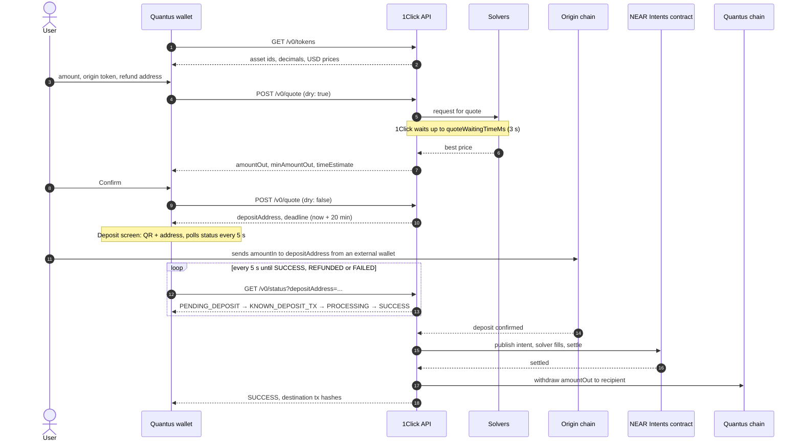
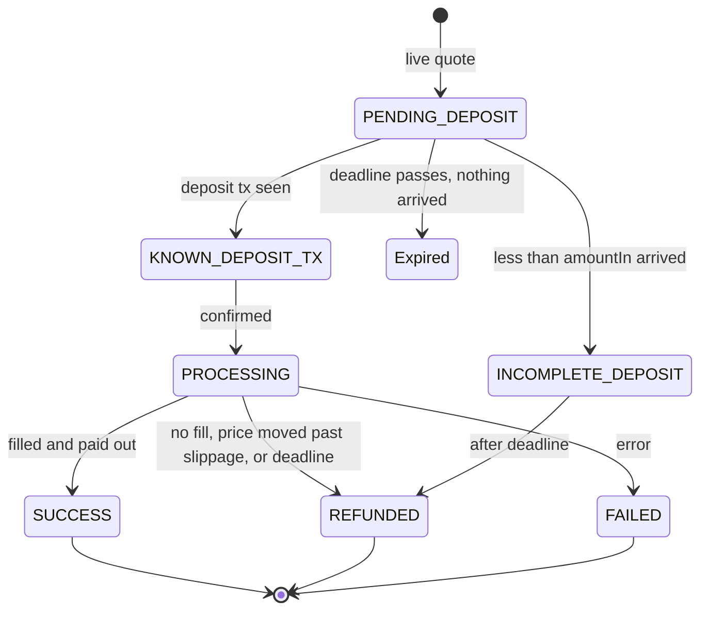

# NEAR Intents swaps

How the wallet swaps another chain's token into QTC through the NEAR Intents 1Click API, who sends what, and who waits on whom.

Verified against the live API on 2026-09-20. There is no testnet for NEAR Intents.

## What NEAR Intents is

An intent is a signed statement of an outcome: "I give X of asset A on chain P and want at least Y of asset B on chain Q." Solvers, which are market makers, compete to fill it. The fill settles on NEAR inside the Intents Verifier contract, and bridged representations of the assets (`nep141:*.omft.near`) move in and out over NEAR's bridges.

The 1Click API (`https://1click.chaindefuser.com`) is the REST front door to all of that. It runs the price auction, hands out one deposit address per quote, watches the origin chain, drives execution, pays out and refunds. The wallet only talks to 1Click. It never signs or holds any of the swapped funds.

## Actors

| Actor | Where it runs | What it does |
| --- | --- | --- |
| User | Their own origin-chain wallet (MetaMask, Phantom, a BTC wallet...) | Types the amount and a refund address, then sends the deposit from that wallet. |
| Quantus wallet | The app, `SwapService` in `quantus_sdk` | Asks 1Click for tokens, quotes and status. Passes the active account as the recipient. |
| 1Click API | NEAR Intents infrastructure | Auction, deposit addresses, chain watching, execution, payout, refunds, status. |
| Solvers | Off-chain market makers connected to 1Click | Price the quote and fill the intent. |
| Intents Verifier contract | NEAR | Settles the fill atomically. |
| Origin chain | ETH, BTC, SOL, BASE... (36 chains listed today) | Where the deposit lands and where refunds go. |
| Destination chain | Quantus | Where the payout would land. Not connected yet, see [Blockers](#blockers). |

## The happy path

## Who waits on whom

| Step | Who waits | On what | How long | What ends it |
| --- | --- | --- | --- | --- |
| Token list | App | 1Click | Under a second | Response. Cached for 10 minutes in the app. |
| Dry quote | App | 1Click, which waits on solvers | 1 to 5 s (`quoteWaitingTimeMs` is 3000) | Best solver price, or "Failed to get quote" if no solver bids. |
| Live quote | App | 1Click | Same as dry | Deposit address is reserved until `deadline`. |
| Deposit | 1Click, app polls | The user's origin-chain transaction | Up to the deadline, 20 minutes in our request | Deposit seen, or deadline passes. |
| Confirmation | 1Click | Origin-chain finality | Seconds on SOL, minutes on ETH, up to an hour on BTC. Docs say allow 15 min. | Enough confirmations. |
| Settlement | 1Click | Solver fill and NEAR finality | Seconds | Intent settled. |
| Payout | 1Click | Destination-chain withdrawal | Seconds to minutes | `SUCCESS` with `destinationChainTxHashes`. |

The app never blocks on anything but its own HTTP calls. The user waits on the deposit screen, and it is safe for them to leave it: 1Click continues regardless. Losing the screen does lose the deposit address in the app, see [Blockers](#blockers).

## Who sends what

| Call | App sends | App reads back |
| --- | --- | --- |
| `GET /v0/tokens` | nothing | `assetId`, `symbol`, `blockchain`, `decimals`, `price`. One asset per symbol is kept, main network first. QTC is dropped from the "from" list. |
| `POST /v0/quote` | `dry`, `swapType: EXACT_INPUT`, `slippageTolerance: 100` (1%), `originAsset`, `destinationAsset`, `amount` in base units, `refundTo` and `refundType: ORIGIN_CHAIN`, `recipient` and `recipientType: DESTINATION_CHAIN`, `deadline`, `quoteWaitingTimeMs: 3000`. `X-API-Key` header when a partner key is configured. | `quote.amountIn`, `amountOut`, `minAmountOut`, `amountInUsd`, `amountOutUsd`, `timeEstimate`, `deadline`, `depositAddress` (live only), `depositMemo`, `correlationId`. The request is echoed back in `quoteRequest`. |
| `GET /v0/status` | `depositAddress`, `depositMemo` if the quote had one | `status`, `swapDetails.amountOut`, `refundedAmount`, `refundReason`, `destinationChainTxHashes[].hash`. |

Amounts are strings of base units in both directions. The wallet parses user input with the origin token's decimals and formats every amount with its own token's decimals.

Errors come back as `{"message": ...}` with a 4xx status. The app shows the message as is. Seen live: `refundTo is not valid`, `tokenOut is not valid`, `Failed to get quote` for an amount too small to fill, and 404 `Deposit address ... not found` on status.

## Swap status

`Expired` is not a 1Click status. 1Click keeps reporting `PENDING_DEPOSIT` after the deadline; the app shows an expired view when the deadline has passed and nothing arrived, and keeps polling in case a late deposit turns into a refund.

## Refunds

- Less than `amountIn` arrives: refunded to `refundTo` after the deadline, minus `refundFee` (0.30 USDC on ETH in the live probe).
- More than `amountIn` arrives: the swap executes and the excess goes to `refundTo`.
- No solver can fill, or the price moves past the slippage: `REFUNDED`.
- 1Click validates `refundTo` against the origin chain at quote time, so a bad refund address never reaches the deposit step.

## Fees

- Without a partner key 1Click adds 25 basis points to every quote. The live probe echoed `appFees: [{recipient: 5880ad2b..., fee: 25}]` on a request that sent none.
- With a partner key from partners.near-intents.org the platform fee is 20 basis points, 1 basis point on stablecoin and same-asset routes. Pass it as `SwapService(apiKey:)`; it goes out as `X-API-Key`.
- Fees are inside `amountOut`. Nothing is charged on top of `amountIn`.
- `refundFee` and `withdrawFee` in the quote are in base units of the origin asset.

## Where this lives in the wallet

| Screen or class | File | 1Click call |
| --- | --- | --- |
| `SwapScreen` | `mobile-app/lib/v2/screens/swap/swap_screen.dart` | Tokens on open. Dry quote on "Get a Quote", recipient is the active account. |
| `ReviewQuoteSheet` | `mobile-app/lib/v2/screens/swap/review_quote_sheet.dart` | Live quote on Confirm, then opens the deposit screen with the order. |
| `DepositScreen` | `mobile-app/lib/v2/screens/swap/deposit_screen.dart` | Status every 5 s. One view per status, plus the expired view. |
| `SwapService` | `quantus_sdk/lib/src/services/swap_service.dart` | The HTTP client. `SwapApiException` carries the server message. |
| `SwapToken`, `SwapQuote`, `SwapOrder` | `quantus_sdk/lib/src/models/swap_*.dart` | Asset ids and BigInt base-unit amounts. |
| Endpoints | `quantus_sdk/lib/src/constants/app_constants.dart` | `oneClickEndpoint`, `quantusIntentsAssetId`. |

Tests: `quantus_sdk/test/services/swap_service_test.dart` covers the request shape, response parsing, every status, and error handling against a mock HTTP client.

## Blockers

1. **QTC is not listed on NEAR Intents.** The token list has 196 assets on 36 chains and none is Quantus. `AppConstants.quantusIntentsAssetId` is a placeholder, and every quote into it fails with `tokenOut is not valid`. Listing needs NEAR Intents to bridge the Quantus chain; that is a conversation with the NEAR Intents team, not a code change here.
2. **No partner key**, so every quote carries the extra 25 basis points.
3. **Orders are not persisted.** If the deposit screen is closed, the app has no record of the deposit address. The user still has it in the wallet they sent from, and 1Click keeps processing.
4. `POST /v0/deposit/submit` is not used. It only speeds up detection by handing 1Click the deposit tx hash.
5. The home swap button stays behind `AppConstants.showSwapButton = false`.
6. Only `EXACT_INPUT` with origin-chain deposits and destination-chain payout. Signed-intent execution would need the wallet to sign NEP-413 or similar payloads.
7. Slippage is fixed at 1%.
